#### 设计模式七大原则

##### 单一职责原则

1. 一个类或者方法应该只负责一项职责

##### 接口隔离原则 Interface Segregation Principle

1. 客户端不应该依赖它不需要的接口，即一个类对另一个类的依赖应该建立在最小接口上

##### 依赖倒转原则 Dependence Inversion Principle

1. 概念
   1. 高层模块不应该依赖低层模块，二者都应该依赖其抽象
   2. 抽象不应该依赖细节，细节应该依赖抽象
   3. 依赖倒转的中心思想是面向接口编程
   4. 接口和抽象类的目的在于制定好规范
2. 依赖关系传递的三种方式
   1. 接口传递
   2. 构造方法传递
   3. setter方式传递
3. 注意事项
   1. 低层模块尽量都要有抽象类或者接口
   2. 变量的声明类型尽量是抽象类或者接口

##### 里氏替换原则 Liskov Substitution Principle

1. 继承实际上让两个类耦合性增强了，在适当的情况下，可以通过聚合，组合，依赖来解决问题

##### 开闭原则 OCP （Open Closed Principle）

1. **对扩展开放（对提供方），对修改关闭（对使用方）**。用抽象构建框架，用实现扩展细节

##### 迪米特法则 Demeter Principle

1. 迪米特法则又叫最少知道原则，即**一个类对自己依赖的类知道的越少越好**。对外除了提供public方法，不对外泄漏任何信息
2. 直接朋友：成员变量，方法参数，方法返回值中的类为直接朋友，而出现在局部变量中的类不是直接的朋友

##### 合成复用原则  Composite Reuse Principle

1. 尽量使用合成、聚合的方式，而不是使用继承

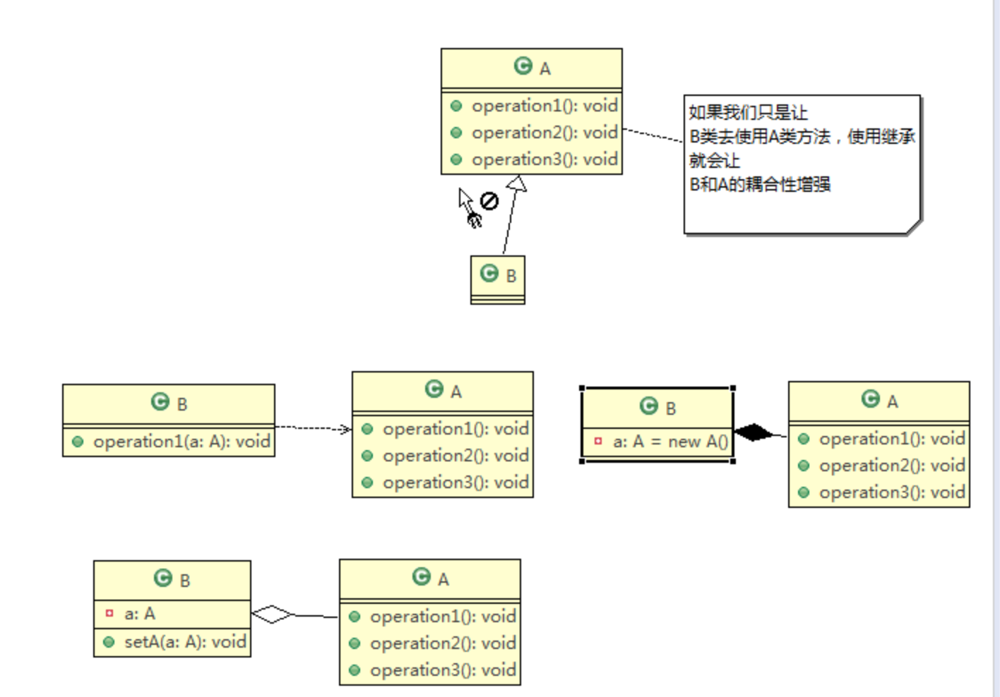

#### UML图

>1. 用于描述系统中的类（对象）本身的组成和类（对象）之间的各种静态关系
>2. 类之间的关系：依赖、泛化（继承）、实现、关联、聚合和组合。
##### 分类

1. 用例图（use case）
2. 静态结构图：**类图**、对象图、包图、组件图、部署图
3. 动态行为图：交互图（时序图与协作图）、状态图、活动图

##### 类之间的关系

1. 依赖关系 Dependence：A类中使用到B类，可以说A类依赖B类

   1. 类中用到了对方
   2. 类的成员属性
   3. 方法的返回类型
   4. 方法接收的参数类型

2. 泛化关系实际上就是继承关系（Generalization）

3. 实现关系 Implementation

4. 关联关系 Association 

   1. 类与类之间的联系，单向和双向的1对多，或者1对1

5. 聚合关系 Aggregation

   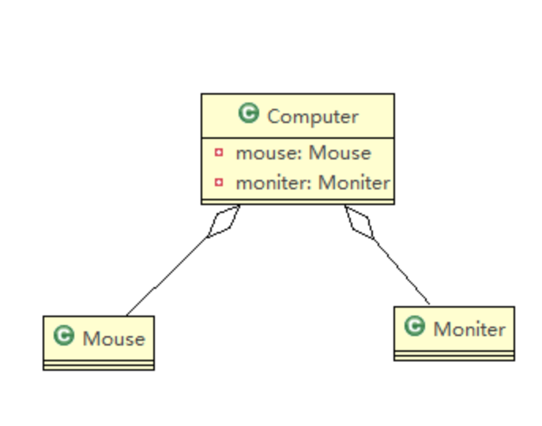

6. 组合关系 Composition 整体和局部不可分开
   1. 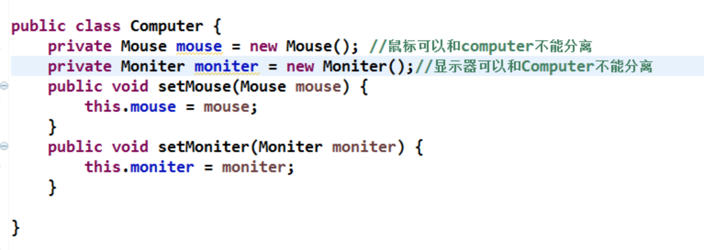

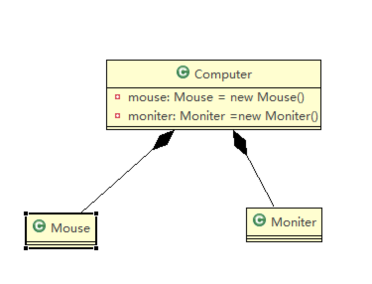

#### 设计模式

设计模式分为三种类型，共23种

1. **创建型：**单例模式、抽象工厂模式、原型模式、建造者模式、工厂模式
2. **结构型：**适配器模式、桥接模式、装饰模式、组合模式、外观模式、享元模式、代理模式
3. **行为型：**模板方法模式、命令模式、访问者模式、迭代器模式、观察者模式、中介者模式、备忘录模式、解释器模式（Interpreter模式）、状态模式、策略模式、职责链模式（责任链模式）

##### 单例模式

> 对某个类只能存在一个对象实例，对于一些需要频繁创建销毁的对象，使用单例模式可以提高系统性能

###### 实现单例的八种方式

1. 饿汉式（静态常量）
   1. 优点：写法简单，在类装载的时候就完成了实例化，避免线程同步问题
   2. 缺点：没有达到Lazy loading的效果，如果从始至终未使用过这个实例，可能会造成内存的浪费
2. 饿汉式（静态代码块），与上面的方式的优缺点类似
3. 懒汉式（线程不安全），不推荐使用
4. 懒汉式（线程安全，同步方法），虽然解决了线程安全，但是synchronize导致效率低下，不推荐使用
5. 懒汉式（线程不安全，同步代码块），不推荐使用
6. 双重检查，推荐使用，解决了懒加载和线程安全的问题
7. 静态内部类，推荐使用，当外部类装载的时候静态内部类不会被装载，当调用静态内部类的静态变量的时候，静态内部类才会被装载，同时类的装载时线程安全的
8. 枚举，推荐使用，可以避免多线程同步问题，还能防止反序列化重新创建新的对象。

###### 单例模式使用场景

1. JDK中的Runtime类，使用的是饿汉式创建的
2. 需要频繁创建和销毁的对象
3. 创建对象时耗时过多或者耗费资源过多（即：重量级对象），但又经常用到的对象
4. 工具类对象、频繁访问数据库或者文件的对象（比如数据源、session工厂等）

###### 注意事项

1. 当想实例化一个单例类的时候，必须记住使用相应的获取对象的方法，而不是使用new

##### 简单工厂模式

> 简单工厂模式是由一个工厂对象决定创建出哪一类产品类的实例；简单工厂模式：定义一个创建对象的类，由这个类来封装实例化对象的行为

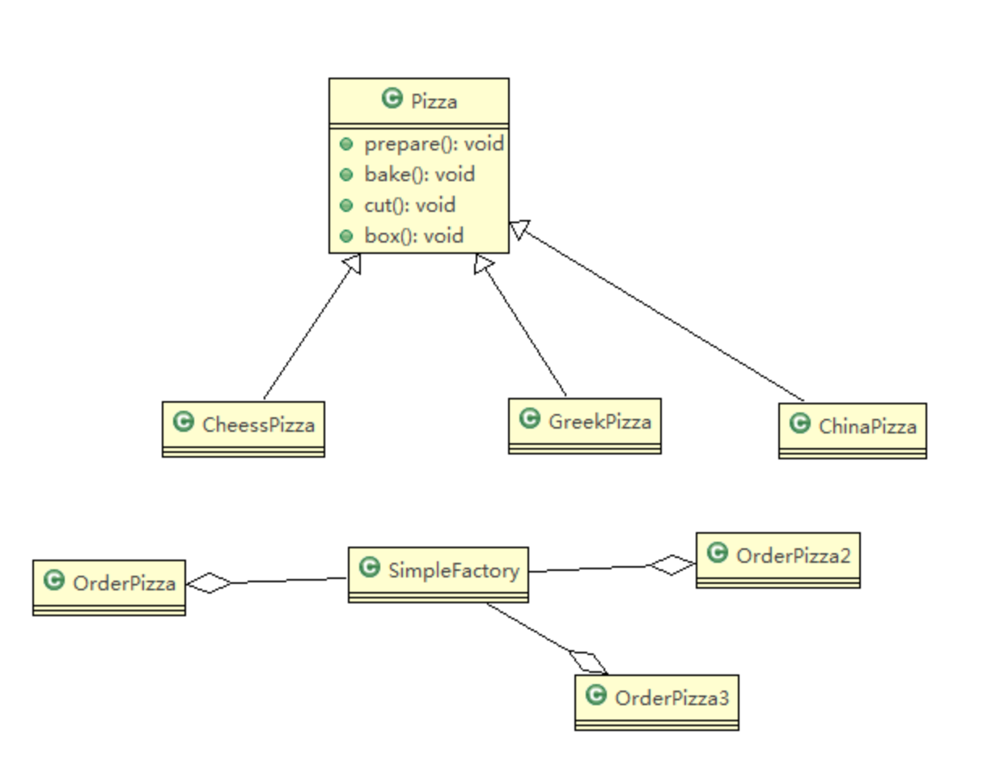

##### 工厂方法模式

> 工厂方法模式：定义了一个创建对象的抽象方法，由子类决定要实例化的类。工厂方法模式将对象的实例化推迟到子类。

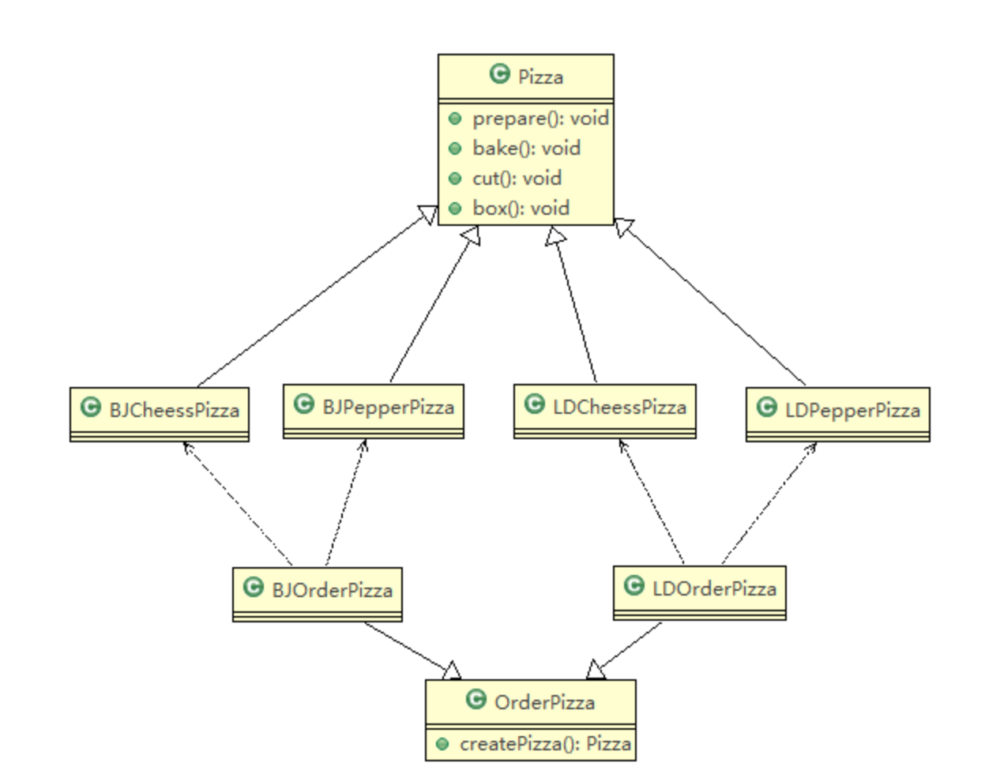

##### 抽象工厂模式

> 定义了一个interface用于创建相关或者有依赖关系的对象簇，而无需指明具体的类；抽象工厂模式可以将简单工厂模式和工厂方法模式进行整合。将工厂抽象成两层，抽象工厂和具体实现的工厂子类。

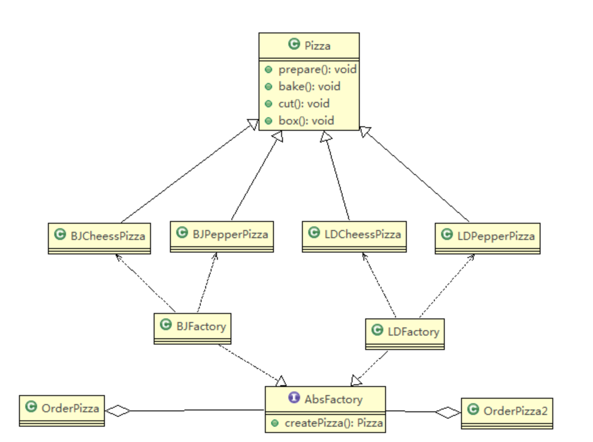

##### 原型模式

> 1. 原型模式（Prototype）是指：用原型实例指定创建对象的种类，并通过拷贝这些原型，创建新的对象
> 2. 原型模式是一种创建型设计模式，允许一个对象再创建另外一个可定制的对象，无需指定如何创建的细节
> 3. 工作原理：通过将一个原型对象传给那个要发动创建的对象，这个要发动创建的对象通过请求原型对象拷贝它们自己来实施创建，即对象.clone()

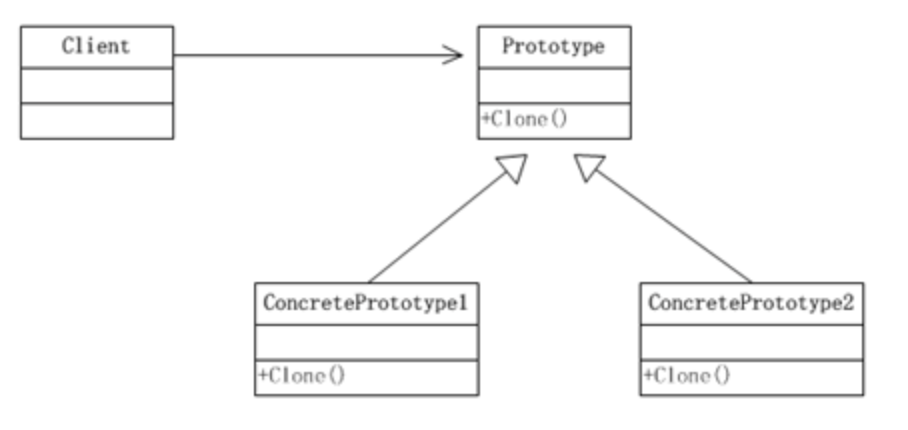

###### 浅拷贝

1. 对于数据类型是基本类型的成员变量，浅拷贝会直接进行值传递，也就是将该属性值复制一份给新的对象。
2. 对于数据类型是引用数据类型的成员变量，那么浅拷贝会进行引用传递

###### 深拷贝

1. 复制对象的所有基本数据类型的成员变量值

2. 为所有引用数据类型的成员变量申请存储空间，并复制每个引用数据类型成员变量所引用的对象，直到该对象可达的所有对象

3. 深拷贝的实现方式：

   1. 重写clone方法
   2. 通过对象序列号实现

##### 建造者模式

> 1. 把产品与产品建造的过程进行解耦
> 2. 建造者模式又叫生成器模式，是一种构建模式。它可以将复杂对象的建造过程抽象出来，使这个抽象过程的不同实现方法可以构造出不同表现（属性）的对象。

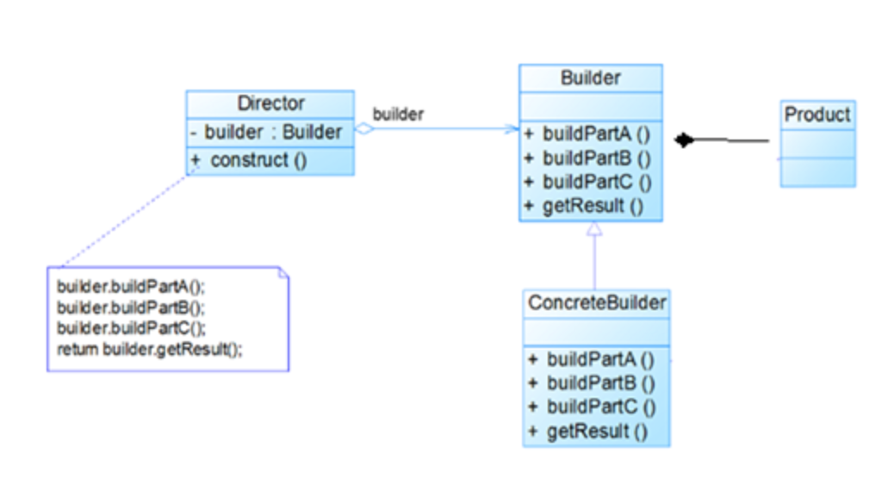

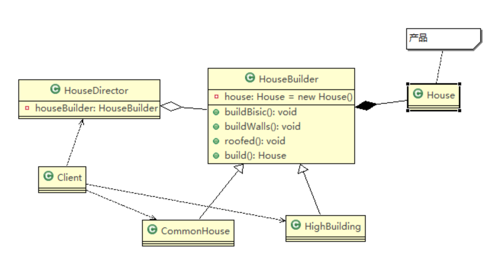

###### 抽象工厂模式VS建造者模式

抽象工厂模式实现对产品家族的创建，一个产品家族是这样的一系列产品：具有不同分类维度的产品组合，采用抽象工厂模式不需要关心构建过程，只关心什么产品由什么工厂生产即可。而建造者模式则是要求按照指定的蓝图建造产品，它的主要目的是通过组装零配件而产生一个新产品。

##### 适配器模式

> 1. 适配器模式（Adapter Pattern）将某个类的接口转换成客户端期望的另一个接口表示，主要目的是兼容性，让原本因接口不匹配不能一起工作的两个类可以协同工作，其别名为包装器（Wrapper）
> 2. 适配器模式属于结构型模式
> 3. 主要分为三类，类适配器模式、对象适配器模式、接口适配器模式

###### 类适配器

1. Adapter类通过继承src类，实现dst类接口，完成src->dst的适配

###### 对象适配器

1. 基本思路和类适配器模式相同，只是将Adapter类作修改，不是继承src类，而是持有src类的实例，以解决兼容性的问题。即持有src类，实现dst类接口，完成src->dst的适配
2. 根据”合成复用原则“，在系统中尽量使用关联关系来替代继承关系
3. **对象适配器模式是适配器模式常用的一种**
4. **与类适配器相比，只是将继承关系变成聚合关系，它解决了类适配器必须继承src的局限性问题，也不再要求dst必须是接口**

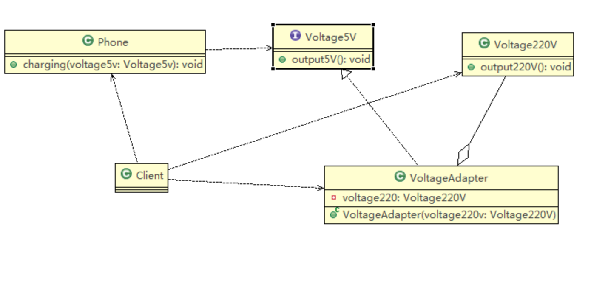

###### 接口适配器模式

1. 也叫缺省适配器模式（Default Adapter Pattern）
2. 当不需要全部实现接口提供的方法时，可先设计一个抽象类实现接口，并为该接口中每个方法提供一个默认方法（空方法），那么该抽象类可有选择地覆盖父类的某些方法来实现需求
3. 适用于一个接口不想使用其所有方法的情况

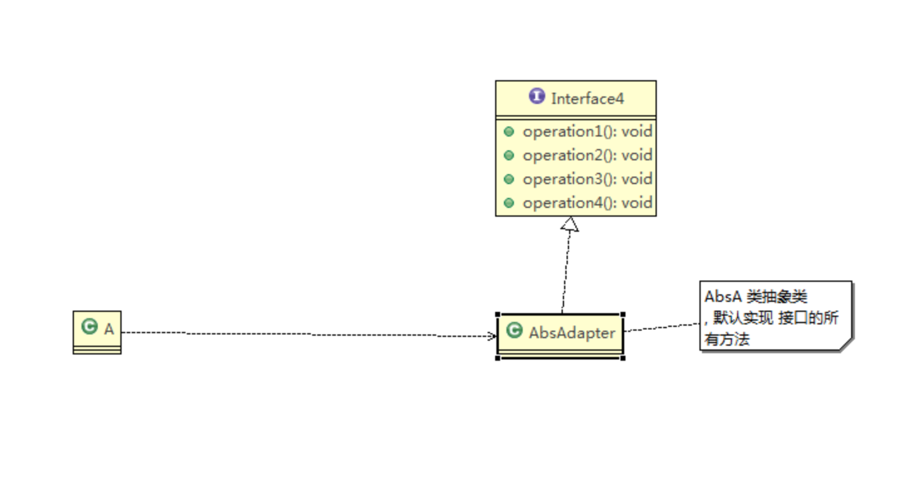

###### 应用场景

SpringMVC中

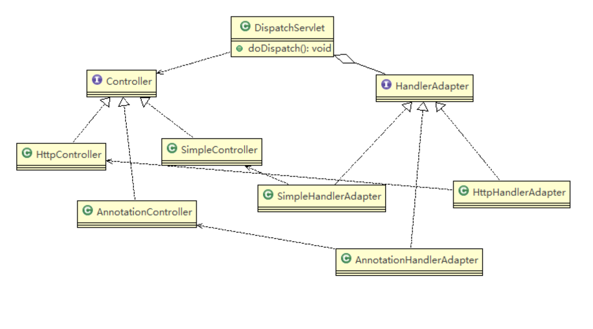

##### 桥接模式

传统方式

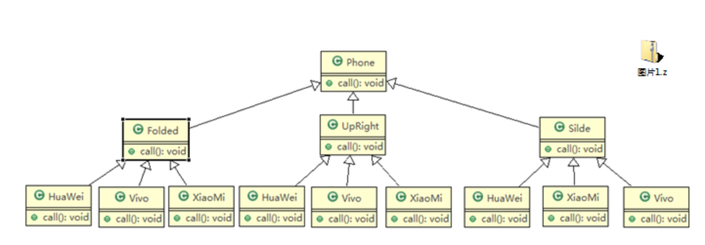

> 1. 桥接模式（Bridge模式）是指：将实现与抽象放在两个不同的类层次中，使两个层次可以独立改变。
> 2. 是一种结构型设计模式。
> 3. Bridge模式基于类的最小设计原则，通过使用封装、聚合及继承等行为让不同的类承担不同的职责。它的主要特点是把抽象（Abstraction）与行为实现（Implementation）分离开来，从而可以保持各部分的独立性以及应对他们的功能扩展。

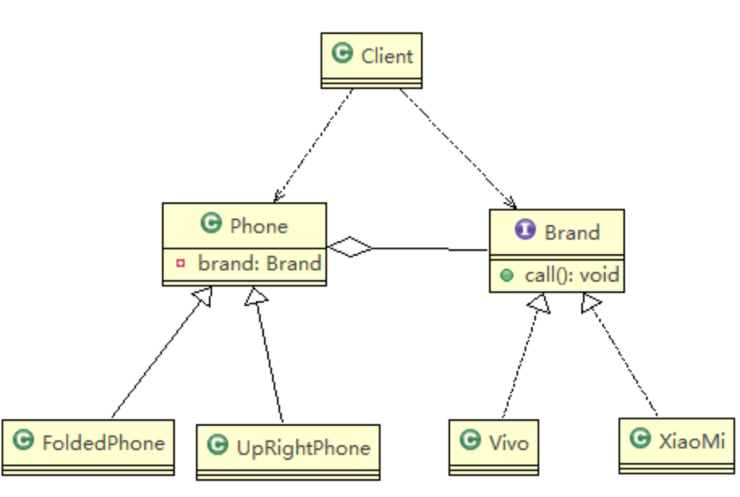

###### 应用场景

1. 对于那些不希望使用继承或因为多层次继承导致类的个数急剧增加的系统，桥接模式尤为适用
2. 常见应用场景：
   1. JDBC驱动程序
   2. 银行转账系统
      1. 转账分类：网上转账，柜台转账，ATM转账
      2. 转账用户：普通用户，银卡用户，金卡用户
   3. 消息管理
      1. 消息类型：即时消息，延时消息
      2. 消息分类：手机短信，邮件消息，QQ消息

##### 装饰者模式

> 装饰者模式：动态的将新功能附加到对象上。在对象功能扩展方面，它比继承更有弹性，装饰者模式也体现了开闭原则（OCP）

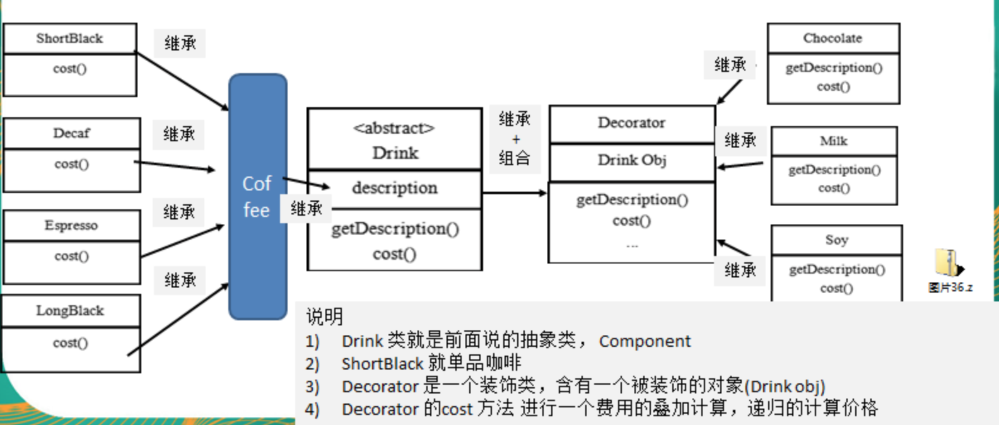

##### 组合模式

> 1. 组合模式（Composite Pattern），又叫部分整体模式，它创建了对象组的树形结构，将对象组合成树状结构以表示”整体-部分“的层次关系。
> 2. 要求较高的抽象性，如果节点和叶子有很多差异性的话，比如很多方法和属性都不一样，不适合使用组合模式 
> 3. 角色
>    1. Component：这是组合中对象声明接口，在适当情况下，实现所有类共有的接口默认行为，用于访问和管理Component子部件，Component可以是抽象类或者接口
>    2. Leaf：在组合中表示叶子节点，叶子节点没有子节点
>    3. Composite：非叶子节点，用于存储子部件，在Component接口中实现子部件的相关操作，比如add、remove

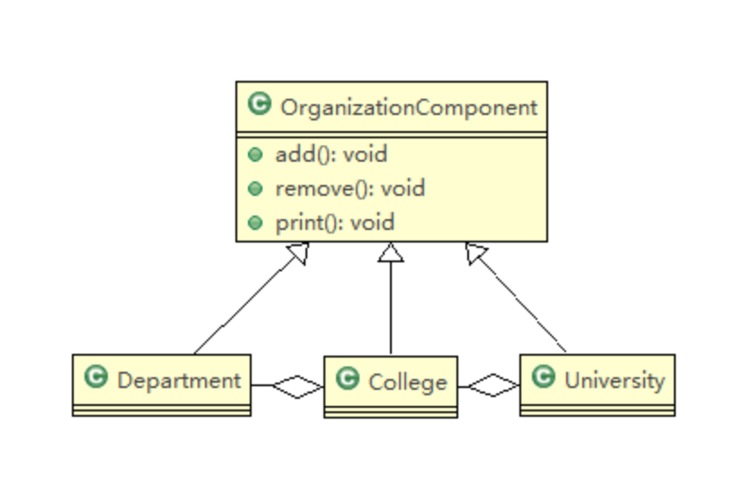

##### 外观模式

> 1. 外观模式（Facade），也叫过程模式，外观模式为子系统中的一组接口提供一个一致的界面，此模式定义了一个高层接口，这个接口使得这一子系统更加容易使用
> 2. 外观模式通过定义一个一致的接口，用以屏蔽内部子系统的细节，使得调用端只需要跟这个接口发生调用，而无需关心这个子系统的内部细节
> 3. 外观模式就是解决多个复杂接口带来的使用困难，起到简化用户操作的作用

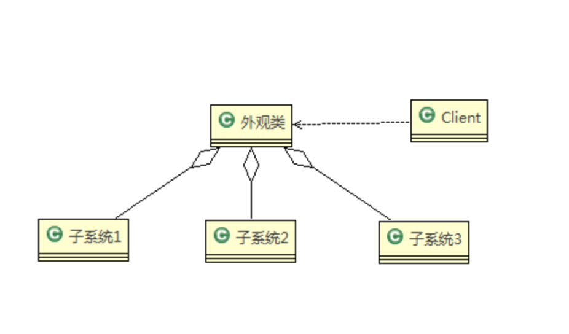

###### 应用场景

Mybatis

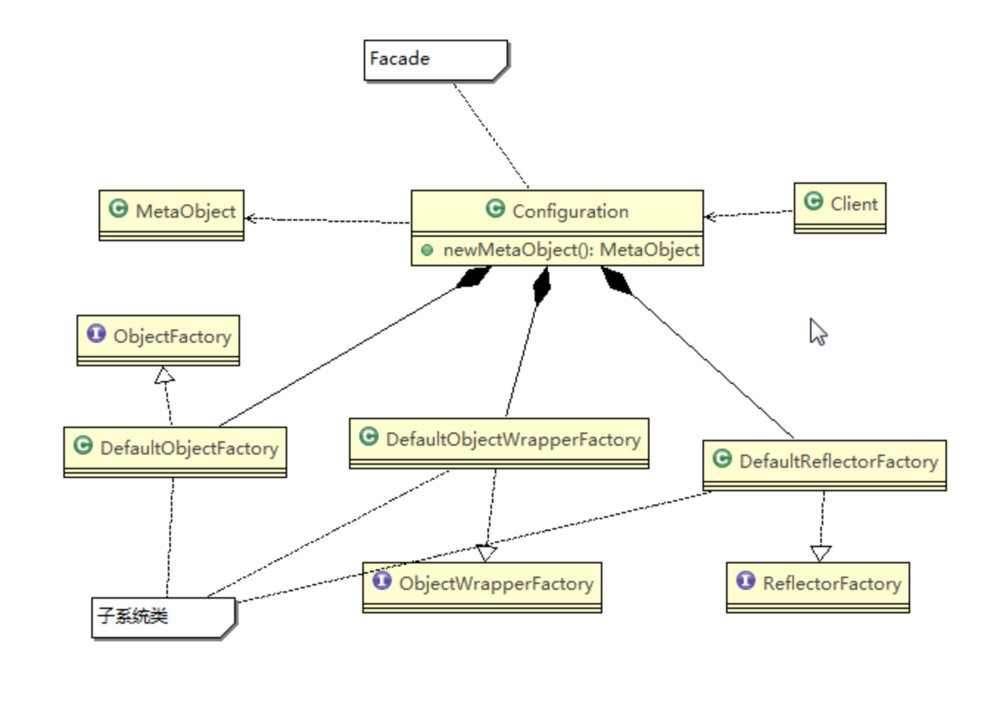

##### 享元模式

> 1. 享元模式（Flyweight Pattern）也叫蝇量模式，运用共享技术有效地支持大量细粒度的对象
> 2. 常用于系统底层开发，解决系统性能问题。像数据库连接池
> 3. 享元模式解决的是重复对象的内存浪费的问题
> 4. 经典的应用场景就是池技术，String常量池、数据库连接池、缓冲池

###### 工作原理

1. Flyweight 是抽象的享元角色，它是产品的抽象类，同时定义出对象的**外部状态（不能共享的部分）和内部状态（能共享的部分）**的接口或实现
2.  ConcreteFlyweight 是具体的享元角色，是具体的产品类，实现抽象角色定义的相关业务
3. UnsharedConcreteFlyweight是不可共享的角色，一般不会出现在享元工厂
4. FlyweightFactory 享元工厂类，用于构建一个池容器（集合），同时提供从池中获取对象方法

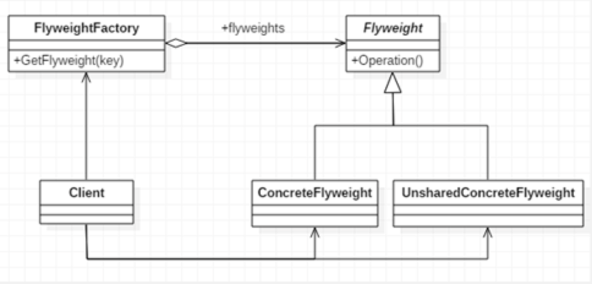

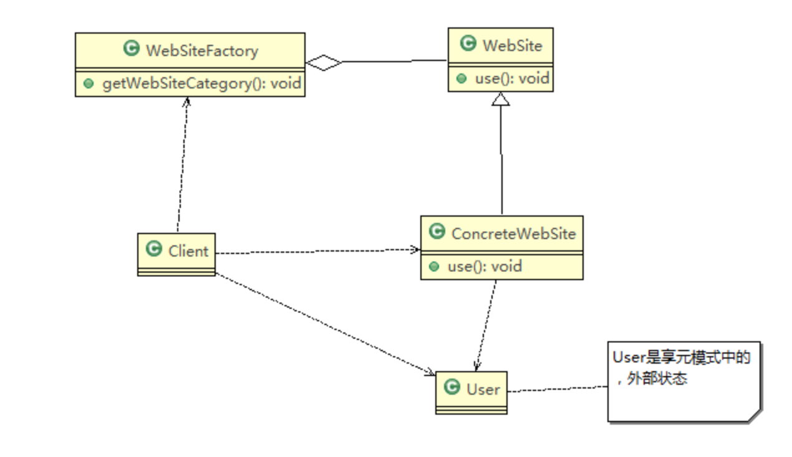

###### 应用场景

JDK中的Integer.valueOf()中，运用了缓存池的技术

##### 代理模式

> 1. 代理模式：为一个对象提供一个替身，以控制对这个对象的访问，即通过代理对象访问目标对象，这样做的好处是：可以在目标对象实现的基础上，增强额外的功能操作，即扩展目标对象的功能。
>
> 2. 被代理对象可以是远程对象、创建开销大的对象或需要安全控制的对象
>
> 3. 代理模式有不同的形式，主要有三种，静态代理、动态代理（JDK代理、接口代理）和Cglib代理（可以载内存动态的创建对象，而不需要实现接口，他是属于动态代理的范畴）

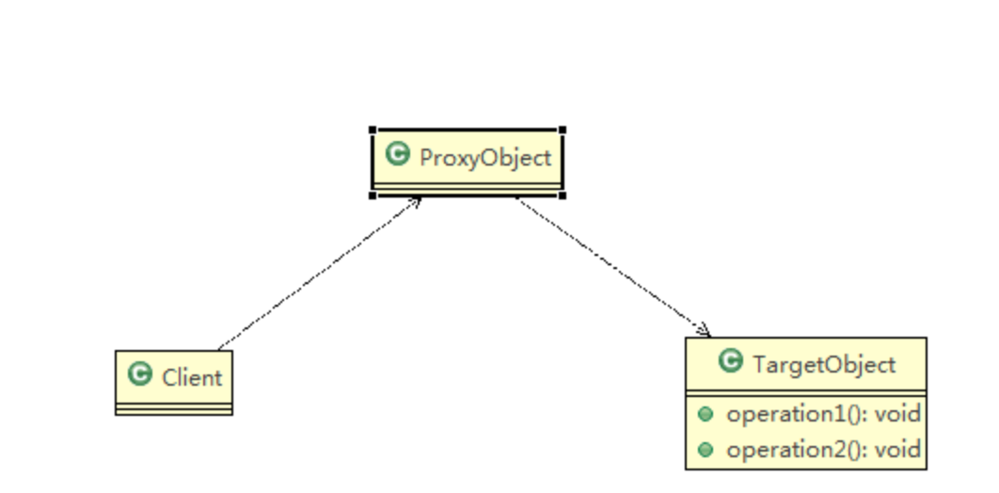

###### 静态代理

> 静态代理在使用时，需要定义接口或者父类，被代理对象（即目标对象）与代理对象一起实现相同的接口或者继承相同父类

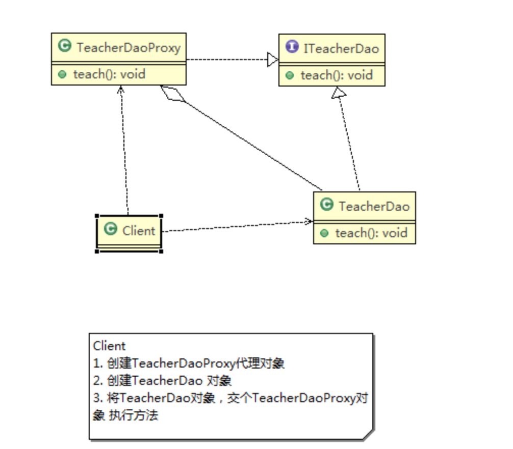

>优点：在不修改目标对象的功能前提下，能通过代理对象对目标功能扩展
>
>缺点：因为代理对象需要与目标对象实现一样的接口，所以会有很多代理类，一旦接口增加方法，目标对象与代理对象都要维护

###### 动态代理

> 1. 代理对象不需要实现接口，但目标对象要实现接口
> 2. 代理对象的生成是利于JDK的API，动态的在内存中构建代理对象
> 3. 动态代理也叫做JDK代理、接口代理

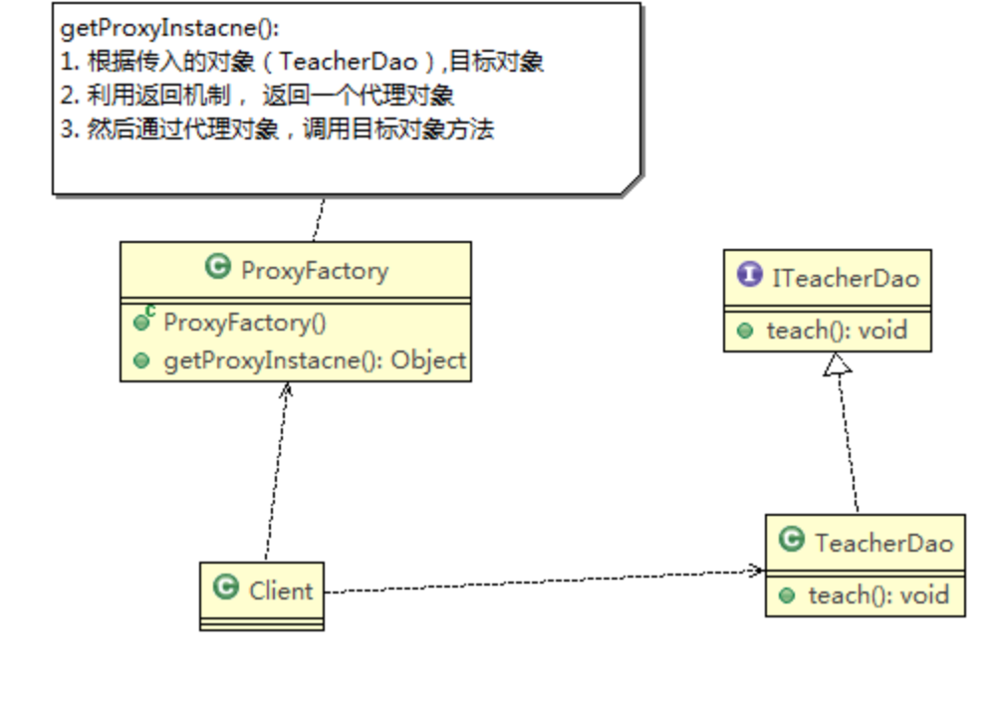

###### Cglib代理

> 1. 静态代理和JDK代理模式都要求目标对象实现一个接口，而Cglib代理则不需要实现任何接口
> 2. Cglib是在内存中构建一个**子类**对象从而实现对目标对象功能扩展
> 3. Cglib是一个强大的高性能的代码生成包，它可以在运行期扩展java类与实现java接口
> 4. 在AOP编程中如何选择代理模式
>    1. 目标对象需要实现接口，使用JDK代理
>    2. 目标对象不需要实现接口，用Cglib代理
> 5. Cglib包的底层是通过使用字节码处理框架ASM来转换字节码并生成新的类
> 6. 代理类不能为final，目标对象的方法如果为final/static，那么就不会被拦截

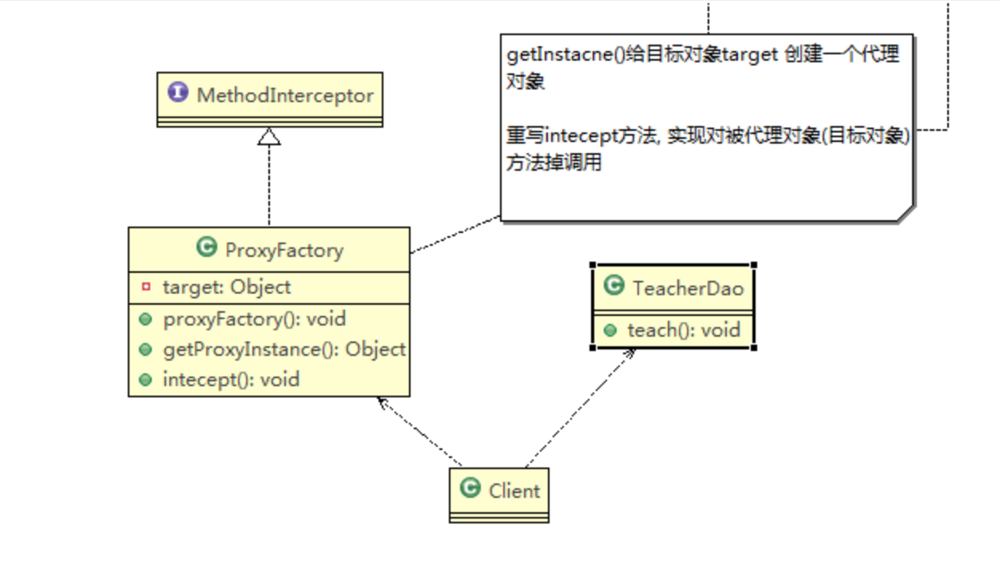

##### 模板方法模式

> 模板方法模式（Template Method Pattern），在一个抽象类公开定义了执行它的方法模板。子类可以按需重写方法实现，但调用将以抽象类中定义的方法进行。
>
> 简单说，模板方法定义了一个操作中的算法的骨架，而将一些步骤延迟到子类中，使得子类不改变一个算法的结构，就可以重新定义该算法的某些特定步骤
>
> 模板方法属于行为型设计模式

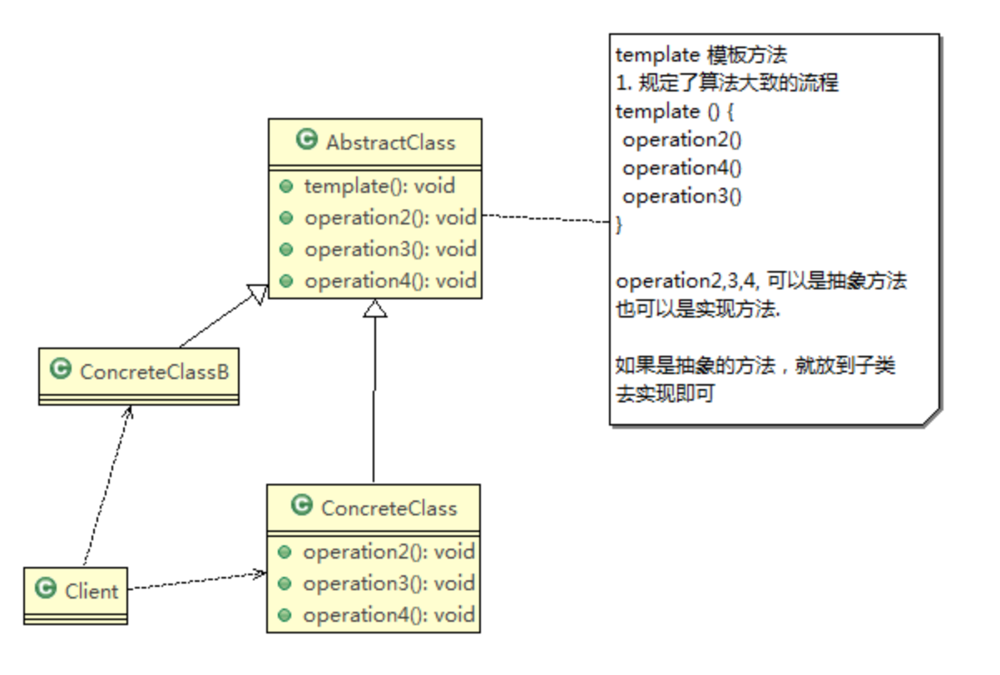

> 模板方法中的钩子方法：
>
> 在模板方法模式的父类中，我们可以定义一个方法，它默认不做任何事，子类可以视情况要不要覆盖它，该方法称为“钩子”

###### 应用场景

> Spring IOC的AbstractApplicationContext中

##### 命令模式(Command Pattern)

> 角色
>
> 1. Invoker是调用者
> 2. Receiver是被调用者
> 3. MyCommand是命令实现了Command的即可，持有被调用者对象

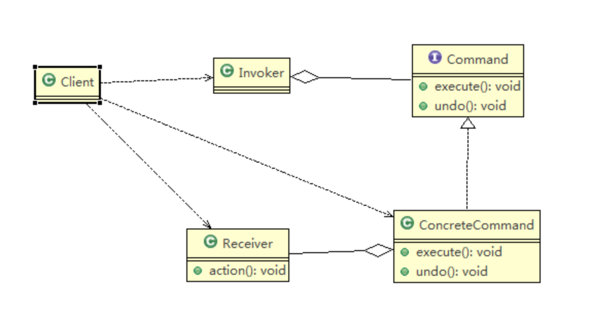

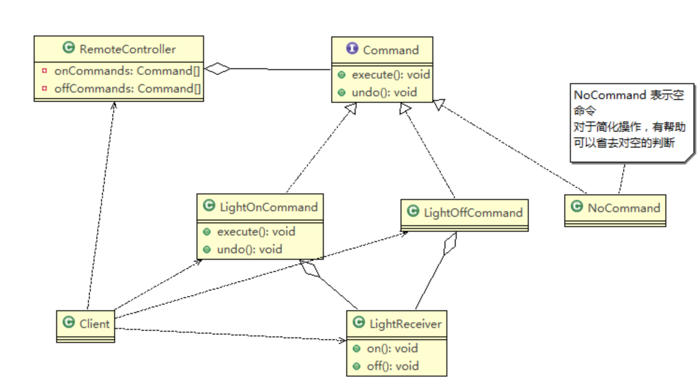

> 命令模式使用场景
>
> Spring的JdbcTemplate

##### 访问者模式

> 访问者模式（Visitor Pattern），封装一些作用于某种数据结构的各元素的操作，它可以在不改变数据结构的前提下定义作用于这些元素的新的操作。
>
> 主要将数据结构与数据操作分离，解决数据结构和操作耦合性问题。
>
> 工作原理：在被访问的类里面加一个对外提供接待访问者的接口
>
> 应用场景：需要对一个对象结构中的对象进行很多不同操作（这些操作彼此没有关联），同时需要避免让这些操作”污染“这些对象的类，可以选用访问者模式解决

> 角色:
>
> Visitor是抽象访问者，为该对象结构中的ConcreteElement的每一个类声明一个visit操作
>
> ConcreteVisitor是一个具体的访问者，实现每个有Visitor声明的操作，是每个操作实现的部分
>
> ObjectStructure能枚举它的元素，可以提供一个高层的接口，用来允许访问者访问元素
>
> Element定义一个accept方法，接收一个访问者对象
>
> ConcreteElement为具体元素，实现了accept方法

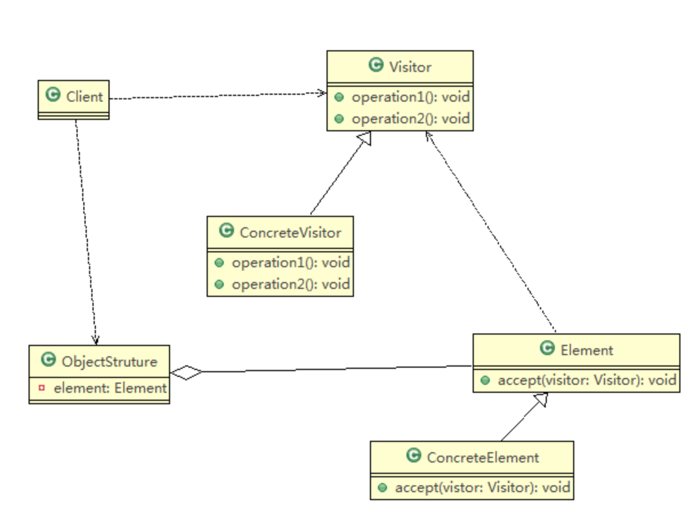

> 优点：
>
> 1. 访问者模式符合单一职责原则，具有优秀的扩展性；
> 2. 访问者可以对功能进行统一，可以做报表、UI、拦截器与过滤器，**适用于结构相对稳定的系统**
>
> 缺点：
>
> 1. 具体元素对访问者公布了细节，也就是说访问者关注了其他类的内部细节，这是迪米特法则不建议的，这样造成具体元素变更比较困难
> 2. 违背了依赖倒转原则。访问者依赖的是具体元素而不是抽象元素
> 3. 因此，如果一个系统具有比较**稳定的数据结构**，又有**经常变化的功能需求**，那么访问者模式就比较适合了

##### 迭代器模式

> 迭代器模式（Iterator Pattern）是常用的设计模式，属于行为模式
>
> 如果我们的集合元素是用不同方式实现的，有数组，还有java的集合类，或者其他方式，当客户端要遍历这些集合元素的时候要使用多种遍历方式，而且还会暴露元素的内部结构，可以考虑使用迭代器模式解决。
>
> 迭代器模式提供一种遍历集合元素的统一接口，用一致的方法遍历集合元素，不需要知道集合对象的底层，即不暴露其内部的结构。

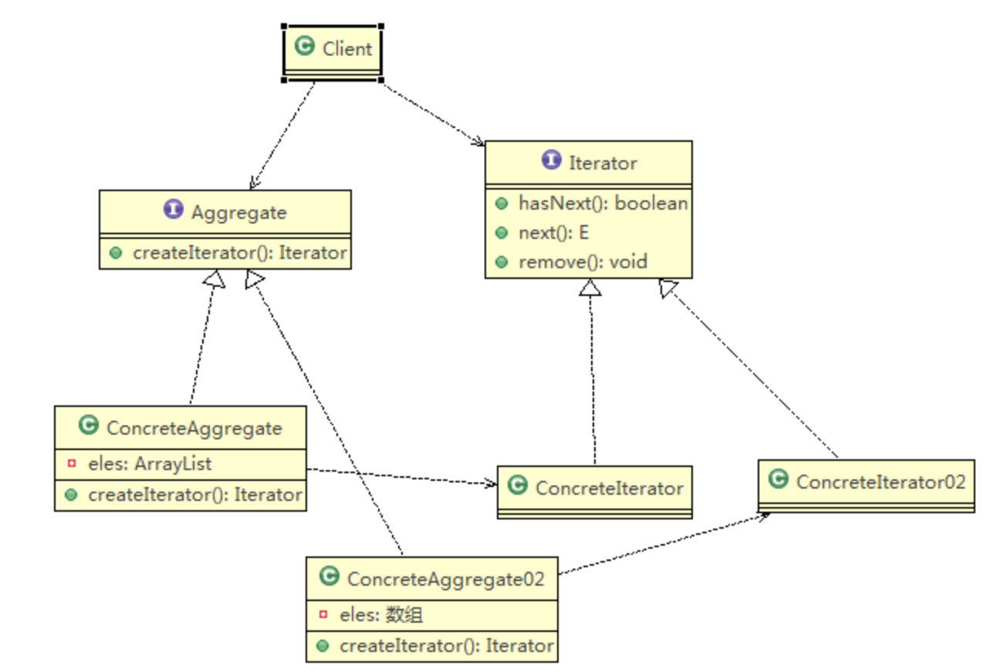

> 优点：
>
> 1. 提供一个统一的方法遍历对象，客户不用再考虑聚合的类型
> 2. 隐藏了聚合的内部结构，客户只需要获取到迭代器就可以遍历了
> 3. 提供了一种设计思想，就是一个类应该只有一个引起变化的原因（单一职责原则）。在聚合类中，我们把迭代器分开，就是要把管理对象集合和遍历集合的责任分开，这样一来集合改变的话，只影响到聚合对象，而如果遍历方式改变的话，只影响到迭代器
> 4. 当要展示一组相似对象，或者遍历一组相同对象时使用
>
> 缺点：
>
> 每个聚合对象都要一个迭代器，会生成多个迭代器，不好管理

##### 观察者模式

> 优点：
>
> 1. 观察者模式会以集合的方式来管理用户（Observer），包括注册、移除和通知。
> 2. 当增加观察者则无需修改核心类，遵守OCP原则

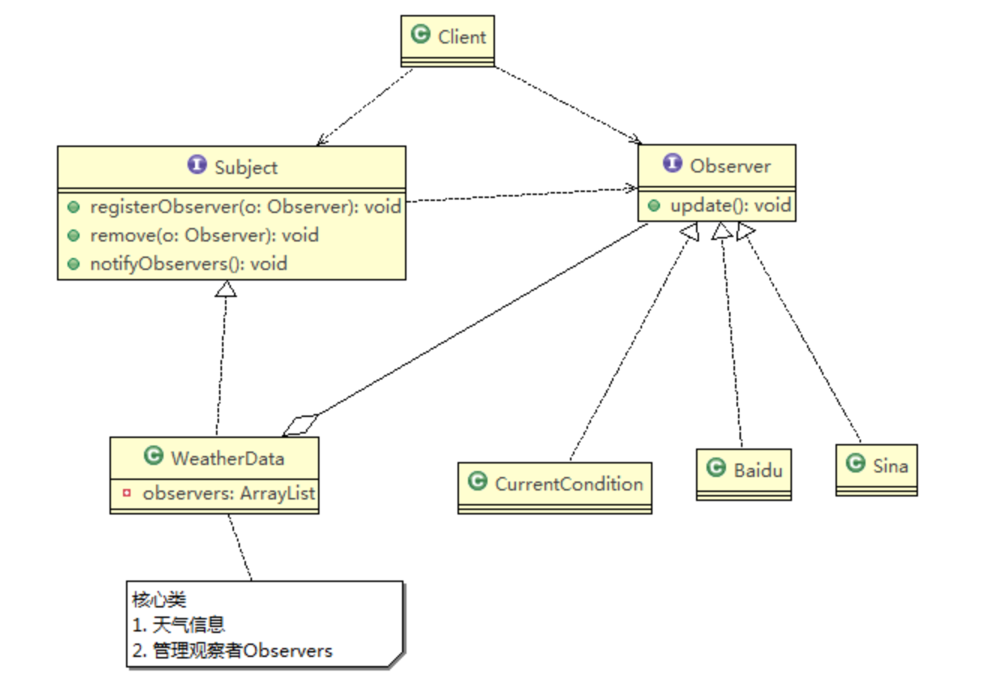

##### 中介者模式

>中介者模式（Mediator Pattern），用一个中介对象来封装一系列的对象交互。中介者使各个对象不需要显示地相互引用，而使其耦合松散，而且可以独立地改变它们之间的交互
>
>中介者模式属于行为型模式，使得代码易于维护

##### 备忘录模式

> 备忘录模式（Memento Pattern）在不破坏封装性的前提下，捕获一个对象的内部状态，并在该对象之外保存这个状态。这样以后就可以将该对象恢复到原先保存的状态

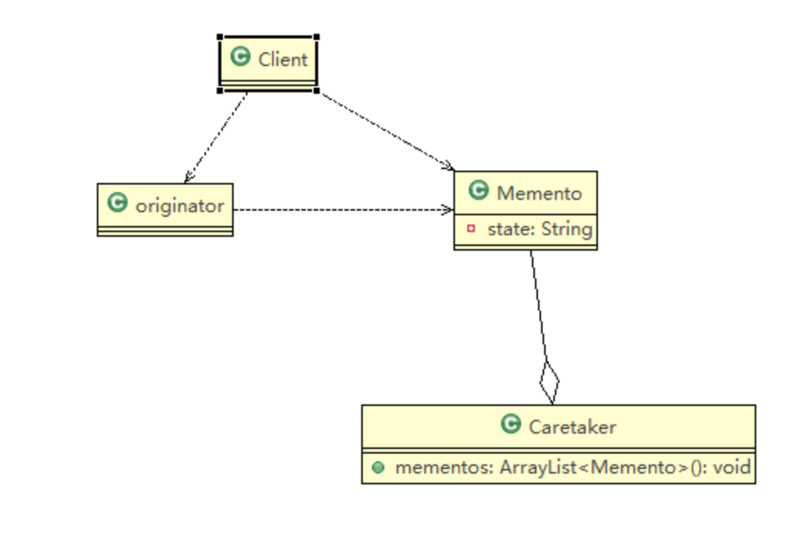
